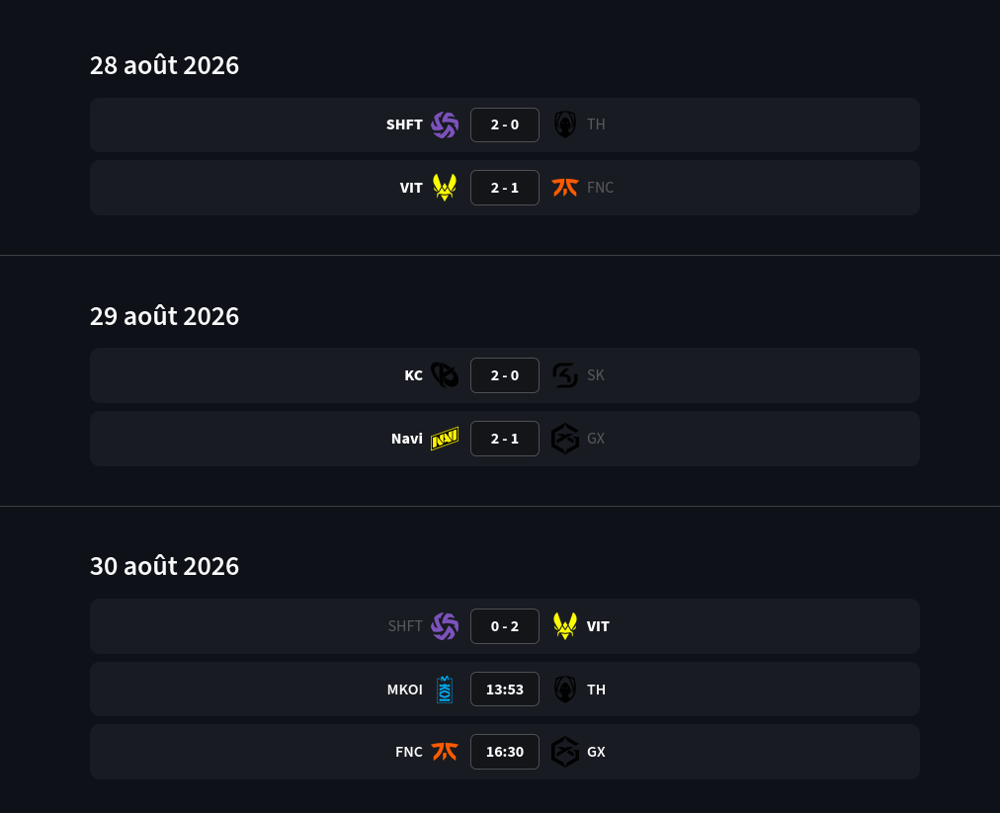
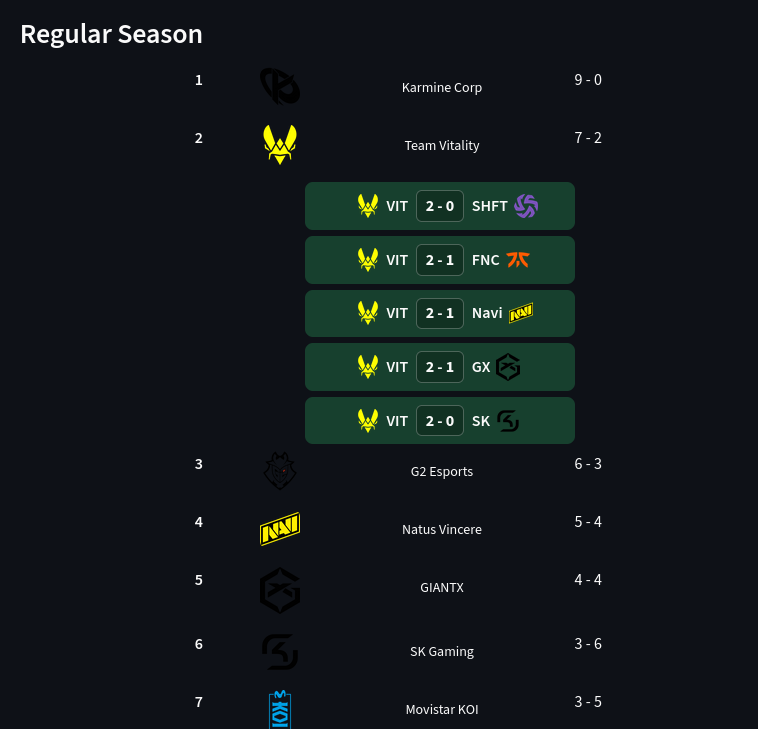
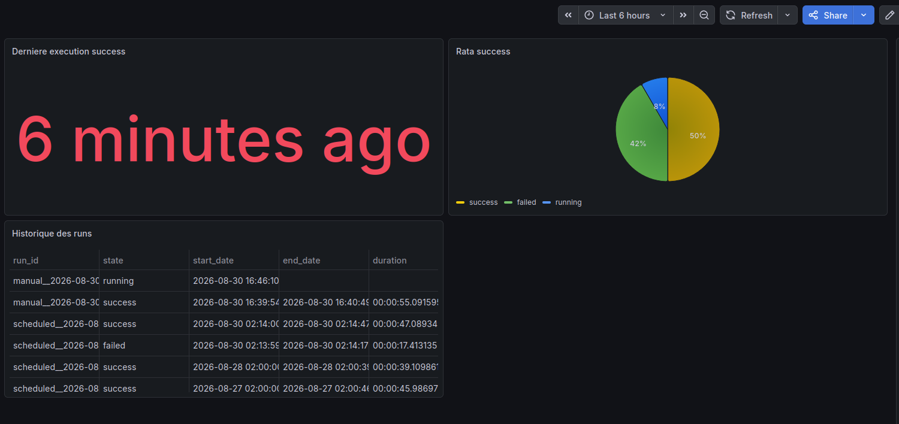
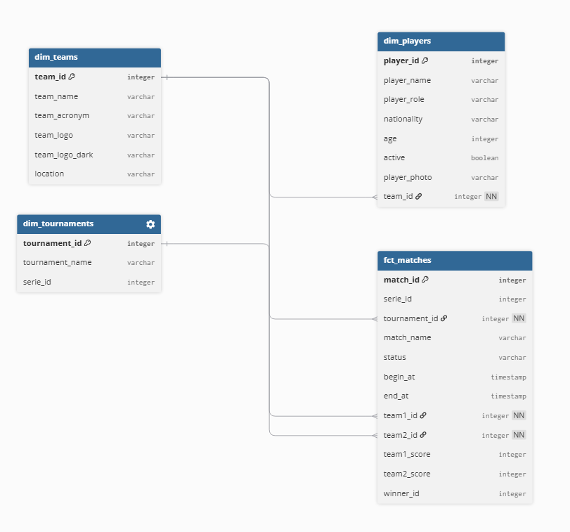
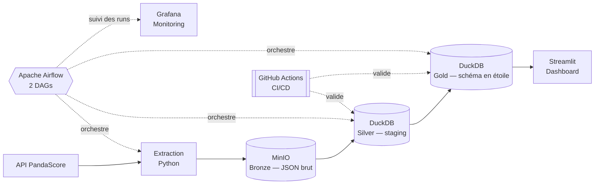

# LEC Stats Pipeline


## Description

Pipeline de données de bout en bout collectant les résultats de la LEC
(League of Legends European Championship) via l'API PandaScore, modélisés
en schéma en étoile et exposés dans un dashboard Streamlit (calendrier,
classement).

Projet portfolio réalisé dans le cadre d'une recherche d'alternance Data
Engineer.

## Aperçu

**Dashboard — Calendrier**


**Dashboard — Classement**


**Monitoring Grafana**


**Modélisation (schéma en étoile)**


## Architecture



## Stack technique

| Couche | Technologie |
|---|---|
| Extraction | Python, Pandas |
| Data Lake (Bronze) | MinIO (S3-compatible) |
| Entrepôt (Silver/Gold) | DuckDB — schéma en étoile |
| Transformation | dbt |
| Orchestration | Apache Airflow |
| Visualisation | Streamlit |
| Monitoring | Grafana |
| Infrastructure | Docker, Docker Compose |

Choix techniques détaillés: [ARCHITECTURE.md](ARCHITECTURE.md)

## Lancer le projet

Nécessite un fichier `.env` (token PandaScore + identifiants MinIO/Airflow/Grafana).

```
docker compose up -d
streamlit run app.py (Dans un second terminal, ouve)
```

Accès :
- Dashboard : http://localhost:8501
- Airflow : http://localhost:8080
- Grafana : http://localhost:3000
- Console MinIO : http://localhost:9001
